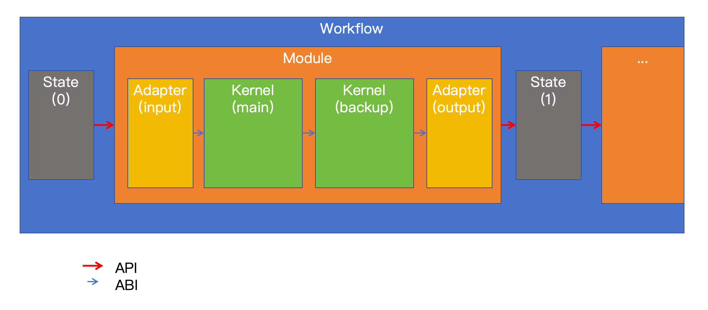

# FusionPRIME

**FusionPRIME: Fusion Plasma Reactive Integrated Modeling Ecosystem**

FusionPRIME 是面向聚变等离子体集成建模的反应式计算生态, 由 Harmonia-Energeia 核心架构和 Theoria 可视化层组成.

- **Harmonia:** Structure, contracts and orchestration
- **Energeia:** Models, kernels and execution
- **Theoria:** Visualization, interaction and exploration

架构名字借用亚里士多德的一对概念, 对应结构定义与实际计算之间的分工:

- **Harmonia (和谐):** 静态的结构与关系, 包括契约, 元模型, registry, graph 和 workflow. 它定义系统中合法的组件及其组合方式, 本身不实现具体的重型物理计算.

- **Energeia (现实活动):** 从潜能到实现的动态过程, 即系统实际运行和产生结果的过程. 它包含 model 和 kernel 的具体实现, 负责执行数值计算. Theoria 延续这一命名体系, 表示对计算对象和结果的观察, 展示与理解.

**什么是 reactive**:

1. State 内部的物理量之间是 reactive 的, 任何一个物理量的变化都会触发相关物理量的更新;
2. Workflow 内部的计算过程是 reactive 的, 任何一个计算结果的变化都会触发相关模块的重新计算.

**为什么是一个 ecosystem**:

FusionPRIME 是一个集成建模生态, 唯一固定的是 Harmonia 架构, 而 Energeia 和 Theoria 都是可插拔的, 可以根据不同的物理问题和计算需求选择不同的实现;

## 基本结构



核心包结构为:

```python
import fusionprime

from fusionprime.harmonia import workflow
from fusionprime.energeia import module, state
from fusionprime.theoria import plot, dashboard
```

Harmonia 是 Module 和 State 的注册表规范, 以及计算图的 AST 和工作流的调度器, 负责定义模块间的契约和数据流, 并提供可插拔的注册机制;

Energeia 存在两层抽象, 是用于计算的核心实现:

- API 层: Module + State
- ABI 层: Kernel + Adapter

Theoria 建立在二者之上, 用于模型, 结果和工作流的可视化与交互探索, 可视化主要集中在 Workflow, Module, State 上, 而 Kernel 和 Adapter 仅提供计算能力, 不直接参与可视化.
